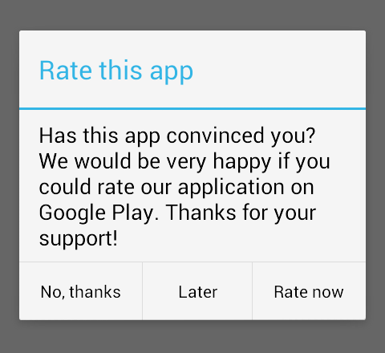

# AppRater

 * Android library that lets you prompt users to rate your application on their appstore (e.g. Google Play)
 * Prompt will only be shown to users after a specified number of days and app launches
 * Adapts to your application's styles and themes

<p align="center">
	
</p>

## Installation

 * Include one of the [JARs](JARs) in your `libs` folder
 * or
 * Copy the Java package to your project's source folder
 * or
 * Create a new library project from this repository and reference it in your project

## Usage

### From `Activity` instances

Decide which `Activity` you want to appear the rating prompt in (usually your ```MainActivity.java```).

At the end of your `Activity`'s `onCreate(...)` or `onResume()`, add the following:

`new AppRater(this).show();`

### From `Fragment` instances

If you want to call the AppRater from a `Fragment` (e.g. at the end of `onCreateView()`), use the following line instead:

`new AppRater(getActivity()).show();`

### Preview (usage during development)

If you want to see a preview of the prompt (usually during development), replace the call to `show()` on the `AppRater` instance with a call to the `demo()` method.

## Customization

You can customize the AppRater by using any of the following calls before ```show()``` (which are all optional):

```java
AppRater appRater = new AppRater(this);
appRater.setDaysBeforePrompt(3);
appRater.setLaunchesBeforePrompt(7);
appRater.setPhrases(R.string.rate_title, R.string.rate_explanation, R.string.rate_now, R.string.rate_later, R.string.rate_never);
mAlertDialog = appRater.show();
```

There are three additional methods which you won't need to call, usually:
```java
appRater.setPhrases("Rate this app", "This is the explanation why you should rate our app.", "Rate now", "Later", "No, thanks");
appRater.setTargetUri("https://play.google.com/store/apps/details?id=%1$s");
appRater.setPreferenceKeys("app_rater", "flag_dont_show", "launch_count", "first_launch_time");
```

The first one lets you set the phrases as Strings directly, without referencing resources. The second one lets you enter an alternative target URI if you want to redirect the user to another appstore than Google Play (e.g. Amazon Appstore). The third method lets you change the name of the preferences, which you won't need to do, usually.

Be sure to check the JavaDoc for all these methods when using them. Don't forget to call ```show()``` which is the most important part.

In addition to that, please keep in mind that you should call `setDaysBeforePrompt(0)` and `setLaunchesBeforePrompt(0)` for debugging purposes, so that you can see the dialog right away.

## Dependencies

 * Android 2.2+

## Contributing

We welcome any contribution, no matter how small or large. Please fork this repository, apply your changes, and submit your contributions by sending a pull request.

## License

```
Copyright (c) delight.im <info@delight.im>

Licensed under the Apache License, Version 2.0 (the "License");
you may not use this file except in compliance with the License.
You may obtain a copy of the License at

  http://www.apache.org/licenses/LICENSE-2.0

Unless required by applicable law or agreed to in writing, software
distributed under the License is distributed on an "AS IS" BASIS,
WITHOUT WARRANTIES OR CONDITIONS OF ANY KIND, either express or implied.
See the License for the specific language governing permissions and
limitations under the License.
```